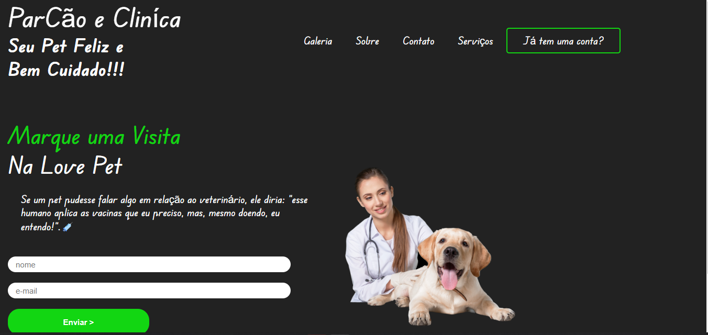

#### Projeto real  de uma landing page para Parque e Clínica Pet. 

#### Desensolvi para praticar os conhecimentos apreendidos na minha jornada acadêmica. 

[]

[]

### Tecnologias utilizadas

 

  
  

   
   

[ ]